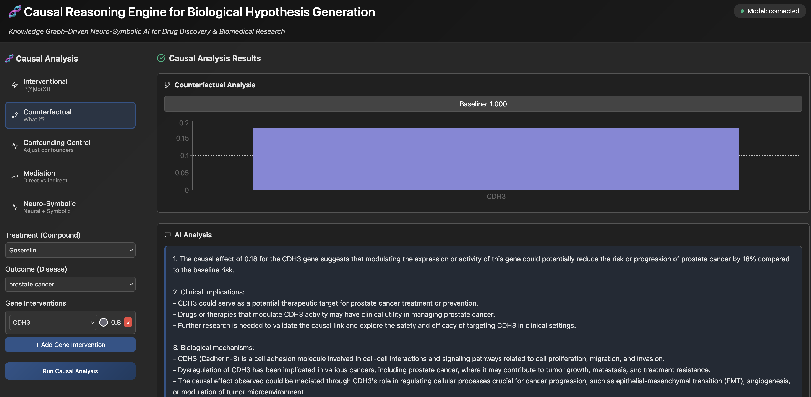

# Causal Reasoning Engine for Life Sciences

A neuro-symbolic causal reasoning engine for biomedical knowledge graphs. It combines a graph neural network over a heterogeneous compound/gene/disease graph with symbolic pathway rules, and uses Amazon Bedrock to turn numeric causal estimates into readable explanations.



The screenshot shows a counterfactual query: intervening on the CDH3 gene for the compound Goserelin against a prostate cancer outcome. The estimated effect is charted, and Amazon Bedrock explains the clinical implications and biological mechanisms below it.

## Architecture

```
React frontend (port 3000)
        |
        v
Flask API (causal_api.py, port 5000)
        |
        +--> CausalGNN + knowledge graph (causal_models.py)
        |
        +--> Amazon Bedrock (Anthropic Claude) for explanation
```

Design notes are in [`model_architecture.md`](model_architecture.md). Frontend-specific usage is in [`README_Frontend.md`](README_Frontend.md).

## Prerequisites

- Python 3.12+ and [uv](https://docs.astral.sh/uv/)
- Node.js 18+
- AWS credentials

## Setup

Install Python dependencies into a local virtual environment:

```bash
uv venv
uv pip install -r requirements.txt
```

Install frontend dependencies:

```bash
cd causal-frontend
npm ci
```

## Data

The knowledge graph loader expects a [Pennsieve](https://www.pennsieve.io/) style dataset as two tab-separated files in one directory:

```
<data-dir>/nodes.tsv    columns: id, kind, name
<data-dir>/edges.sif    columns: source, metaedge, target
```

`kind` values used by the loader are `Compound`, `Gene`, `Disease`, `Anatomy`, `Biological Process`, `Molecular Function`, `Side Effect`, and `Symptom`. The loader caps each node type (100 compounds, 200 genes, 100 diseases) to keep the sample small.

No dataset is included in this repository. Point the code at your own copy:

```bash
export PENNSIEVE_DATA_DIR=/path/to/pennsieve/files/tsv
```

`causal_training.py` and `causal_inference.py` read `PENNSIEVE_DATA_DIR`.

Note that node feature vectors are randomly initialised rather than derived from biological embeddings, so results are illustrative.

## Running

Train a model and write `trained_causal_model.pth`:

```bash
.venv/bin/python causal_training.py
```

Start the API:

```bash
.venv/bin/python causal_api.py
```

Start the frontend in a second terminal:

```bash
cd causal-frontend
npm start
```

The UI is served at http://localhost:3000 and proxies API calls to http://localhost:5000.

## API

All analysis endpoints accept JSON and return JSON.

| Method | Path | Description |
| --- | --- | --- |
| `GET` | `/status` | Readiness check |
| `GET` | `/nodes` | Compound, gene, and disease nodes for the UI |
| `POST` | `/causal/analyze` | Dispatches on `analysis_type` |
| `POST` | `/causal/intervention` | Interventional estimate, P(Y given do(X)) |
| `POST` | `/causal/counterfactual` | Counterfactual under gene interventions |
| `POST` | `/causal/backdoor` | Backdoor-adjusted average treatment effect |
| `POST` | `/causal/mediation` | Direct and indirect effect decomposition |
| `POST` | `/graph/subgraph` | Subgraph connecting a treatment and outcome |

Example:

```bash
curl -X POST http://127.0.0.1:5000/causal/analyze \
  -H 'Content-Type: application/json' \
  -d '{"analysis_type":"intervention","treatment_idx":0,"outcome_idx":0}'
```

## Causal methods

- **Interventional prediction** estimates P(Y given do(X)), the outcome probability under an intervention that sets the treatment.
- **Counterfactual analysis** evaluates alternative gene expression scenarios.
- **Backdoor adjustment** conditions on confounders to reduce bias in the effect estimate.
- **Mediation analysis** splits a total effect into direct and indirect pathway contributions.

Causal estimates rest on untestable assumptions about the underlying graph. Treat output as hypothesis generation for expert review, not evidence.

## Contributing

See [CONTRIBUTING.md](CONTRIBUTING.md) and [CODE_OF_CONDUCT.md](CODE_OF_CONDUCT.md).

Report security issues via the process in [CONTRIBUTING](CONTRIBUTING.md#security-issue-notifications) rather than opening a public issue.

## License

Licensed under the MIT-0 License. See [LICENSE](LICENSE).
