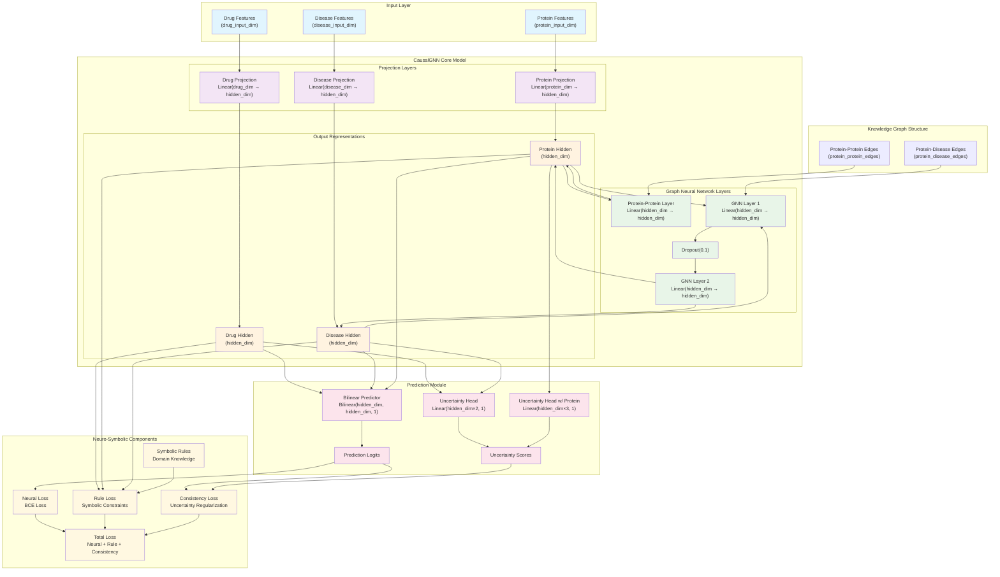
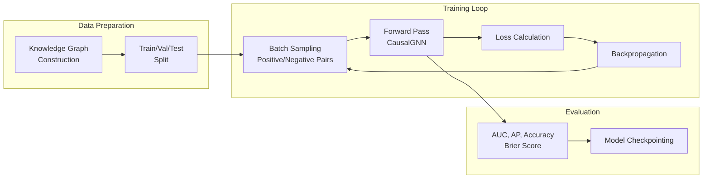

# CausalLLM Model Architecture

## Overview
The CausalLLM system implements a Causal Graph Neural Network (CausalGNN) for biomedical causal reasoning and drug repurposing.

## Core Architecture Diagram



## Model Components Detail

### 1. Input Features
- **Drug Features**: Chemical properties, molecular descriptors (configurable dimension)
- **Protein Features**: Protein sequences, functional annotations (configurable dimension)
- **Disease Features**: Clinical phenotypes, disease ontology (configurable dimension)

### 2. Graph Structure
- **protein_disease_edges**: Protein-disease associations from knowledge graph
- **protein_protein_edges**: Protein-protein regulatory networks and interactions

### 3. CausalGNN Architecture
```
Input Dimensions:
├── Drug: drug_input_dim (configurable)
├── Protein: protein_input_dim (configurable)
└── Disease: disease_input_dim (configurable)

Hidden Dimension: hidden_dim (default: 128)

Layers:
├── Projection: Linear(input_dim → hidden_dim) with ReLU
├── Protein-Protein: Linear(hidden_dim → hidden_dim) for P-P interactions
├── GNN Layers: 2 layers with message passing and dropout
└── Output: hidden_dim-dimensional representations
```

### 4. Prediction Mechanism
```python
# Bilinear prediction with optional protein integration
if protein_embedding is not None:
    drug_proj = drug_embedding + 0.3 * protein_embedding
    disease_proj = disease_embedding + 0.3 * protein_embedding
    logits = bilinear_predictor(drug_proj, disease_proj)
    uncertainty = uncertainty_head_with_protein(cat([drug, protein, disease]))
else:
    logits = bilinear_predictor(drug_embedding, disease_embedding)
    uncertainty = uncertainty_head(cat([drug_embedding, disease_embedding]))
```

### 5. Key Implementation Details
- **Xavier Initialization**: All linear layers use Xavier uniform initialization
- **Dropout**: 0.1 dropout rate applied during message passing
- **Message Passing**: Uses index_add_ for efficient sparse operations
- **Uncertainty Quantification**: Sigmoid activation for uncertainty scores

## Training Pipeline



## Key Features

### Heterogeneous Graph Processing
- Handles different node types (drugs, proteins, diseases) with separate projections
- Supports multiple edge types with specialized message passing
- Efficient sparse tensor operations for large-scale graphs

### Uncertainty-Aware Predictions
- Dual uncertainty heads for different prediction contexts
- Protein-aware uncertainty estimation when mediator information is available
- Calibrated uncertainty scores for reliable confidence estimates

### Scalability
- Memory-optimized adjacency matrix representations
- Batch processing for large-scale datasets
- Efficient graph convolution with index-based operations

## Performance Metrics

The model is evaluated using:
- **Area Under Curve (AUC)**: Area Under ROC Curve
- **Average Precision (AP)**: Average Precision Score
- **Accuracy**: Classification accuracy at 0.5 threshold
- **Brier Score**: Calibration metric for probabilistic predictions

## Data Structure

The model uses the `HeterogeneousKnowledgeGraph` dataclass containing:
- Node features for each entity type
- Edge lists for different relationship types
- Train/validation/test splits
- Environment assignments for causal inference
- Node mappings and names for interpretability